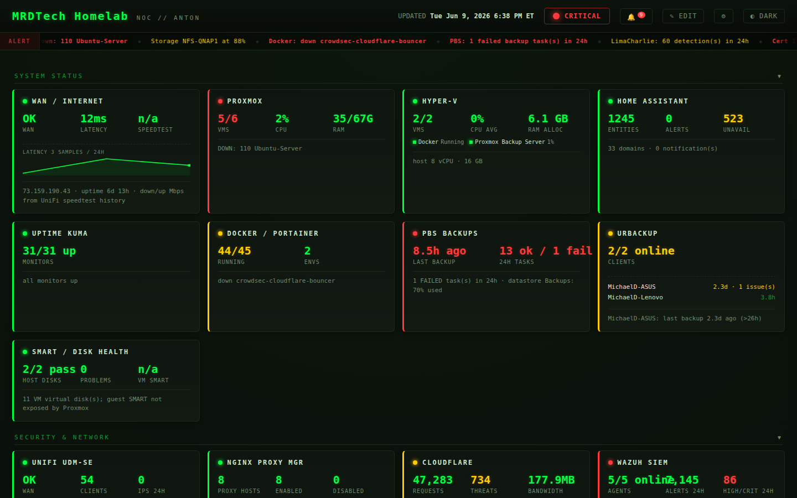

# 🖥️ Homelab Monitoring & Automation Stack

> ⚠️ This project has been superseded by NOC Dashboard. This repository is archived and read-only.


> A complete, self-hosted NOC (Network Operations Center) for a Proxmox homelab —
> agentic automation, a zero-dependency live dashboard, SIEM hardening, and 18
> scheduled monitors that push to Telegram and Gotify. Built to run unattended.


---

## ⭐ The NOC Dashboard (hero feature)

A **single Python file with zero runtime dependencies** polls every service in the
lab and renders a self-contained, dark-themed HTML operations dashboard — no
framework, no database, no build step. A cron job regenerates it every 15 minutes;
any web server serves the static file.



*Live dashboard — dark terminal aesthetic, section management, edit mode, 40+ integrations*

```
┌─ PROXMOX ──────┐ ┌─ DOCKER ───────┐ ┌─ PBS ──────────┐ ┌─ WAZUH SIEM ───┐
│ 9/10 VMs up    │ │ 42 running     │ │ 4 stores OK    │ │ 5/5 agents     │
│ CPU 18% RAM 61%│ │ 0 unhealthy    │ │ last bkp ✓     │ │ alerts 8,646   │
└────────────────┘ └────────────────┘ └────────────────┘ └────────────────┘
┌─ CROWDSEC ─────┐ ┌─ ADGUARD DNS1 ─┐ ┌─ ADGUARD DNS2 ─┐ ┌─ UNIFI ────────┐
│ 1,204 bans     │ │ 2.2M blocked   │ │ 1.8M blocked   │ │ WAN OK · 53 cl │
│ ▁▂▃▅▇ trend    │ │ ▁▃▅▆▇ trend    │ │ ▁▃▅▆▇ trend    │ │ IPS 0 · 1Gbps  │
└────────────────┘ └────────────────┘ └────────────────┘ └────────────────┘
```

Each service is an isolated, fault-tolerant collector — one API being down
degrades only its card, never the page. Trend sparklines are inline SVG built
from a rolling daily snapshot. **[Full dashboard docs →](dashboard/README.md)**

---

## What is this?

This repo is the automation and monitoring layer that sits on top of a Proxmox
homelab. It has four parts:

1. **🤖 Agentic control node (Hermes)** — an AI agent running on a dedicated VM
   that manages the lab: runs the cron scripts, queries every API, drives SSH
   deployments, and answers operational questions. The Python scripts here are
   what it schedules and executes.
2. **📊 NOC dashboard** — the zero-dependency live status page above.
3. **🛡️ Security hardening** — Wazuh SIEM active-response, a low-noise Sysmon
   detection ruleset, brute-force auto-blocking, and DNS-aware alert delivery.
4. **🔔 18 scheduled monitors** — backup verification, VM/disk/container health,
   threat digests, cert expiry, new-device detection, and alerting heartbeats.

Everything is **stdlib-only Python** (the control node has no `pip`), reads all
hosts and credentials from a single `.env`, and delivers alerts to **Telegram**
(primary) and **Gotify** (out-of-band fallback).

---

## 🧱 The Monitoring Stack

| Layer | Tool | Role |
|-------|------|------|
| **SIEM** | **Wazuh** | endpoint monitoring, log aggregation, Sysmon detections, active response |
| **Behavioral IPS** | **CrowdSec** | crowd-sourced detection + automated banning (firewall/Cloudflare/nginx bouncers) |
| **DNS filtering** | **AdGuard Home** | ad/tracker/malware blocking, two redundant instances |
| **Recursive DNS** | **Unbound** | DNSSEC-validating resolver behind AdGuard |
| **Network/IPS** | **UniFi (UDM-SE)** | routing, firewall, IDS/IPS, per-SSID client telemetry |
| **Edge** | **Cloudflare** | DNS, WAF, Zero Trust tunnels |
| **Remote access** | **Tailscale** | mesh VPN, MagicDNS, key-expiry monitoring |
| **Uptime** | **Uptime Kuma** | per-service up/down + TLS cert-days tracking |
| **Backups** | **Proxmox Backup Server + URBackup** | VM + endpoint backup, verification reporting |
| **Notifications** | **Telegram + Gotify** | primary + out-of-band alert channels |

---

## ⏰ Cron Schedule (18 jobs)

All jobs run script-only (no LLM), silent unless there's something to report.

| Job | Schedule | Script | Purpose |
|-----|----------|--------|---------|
| Docker Watchdog | every 15 min | `alert_docker_watchdog.py` | container drop alerts (Portainer) |
| Dashboard Regenerate | every 15 min | `generate_dashboard.py` | rebuild NOC dashboard HTML |
| New Device Alert | hourly | `alert_new_device.py` | first-seen MAC on the network (UniFi) |
| VM Health Check | every 2 h | `alert_vm_health.py` | running VM dropped / recovered (Proxmox) |
| Docker Health | every 2 h | `docker_watchdog.py` | Portainer container health sweep |
| Disk Space Alert | every 6 h | `alert_disk_space.py` | Proxmox storage > 85% |
| Wazuh Alert Digest | daily 20:00 | `report_wazuh_alerts.py` | high/critical SIEM alerts (24h) |
| CrowdSec Digest | daily 20:00 | `report_crowdsec.py` | new detections, bans, bouncer status |
| AdGuard Stats | daily 20:00 | `report_adguard.py` | query count, block rate, top domains |
| UniFi Threat Digest | daily 20:00 | `report_unifi_threats.py` | IDS/IPS detections, WAN status |
| Uptime Kuma Digest | daily 20:00 | `report_uptime_kuma.py` | monitor up/down + TLS cert days |
| PBS Backup Verify | daily 08:00 | `report_pbs_backups.py` | last-24h backup/verify results |
| URBackup Report | daily 08:00 | `report_urbackup.py` | client backup freshness |
| Cert Expiry Alert | daily 08:30 | `alert_cert_expiry.py` | TLS certs below threshold |
| Tailscale Key Expiry | daily 09:00 | `alert_tailscale_key_expiry.py` | API key nearing expiry |
| Telegram Heartbeat | weekly Mon 09:00 | `telegram_heartbeat.py` | verifies alert delivery path still works |
| Morning Briefing | weekly Sat 11:00 | `morning_briefing.py` | full infra summary |
| Weekly Infra Report | weekly Sat 12:00 | `report_weekly.py` | backup success rate, uptime, trends |

---

## 🚀 Quick Start

```bash
# 1. Clone
git clone https://github.com/YOUR_GITHUB_USER/homelab-monitoring.git
cd homelab-monitoring

# 2. Configure — copy the template and fill in YOUR hosts + credentials
cp .env.template ~/.hermes/.env
chmod 600 ~/.hermes/.env
$EDITOR ~/.hermes/.env

# 3. Install the scripts
mkdir -p ~/.hermes/scripts
cp scripts/*.py ~/.hermes/scripts/

# 4. Generate the dashboard once to verify connectivity
python3 ~/.hermes/scripts/generate_dashboard.py
#  → ~/homelab-dashboard/index.html

# 5. Serve it (keep it behind VPN/Tailscale — never public)
cd ~/homelab-dashboard && python3 -m http.server 8080

# 6. Schedule the monitors (cron or systemd timers — see docs/setup.md)
```

See **[docs/setup.md](docs/setup.md)** for the full from-scratch build and
**[wazuh/README.md](wazuh/README.md)** to apply the SIEM hardening.

---

## 🗺️ Architecture

A Proxmox node hosts ~12 purpose-built VMs (control node, Docker, SIEM, DNS,
backup, etc.). The control node polls everything over the LAN and pushes alerts
out. Full VM layout and service map: **[docs/architecture.md](docs/architecture.md)**.

```
Internet ─▶ Cloudflare ─▶ UniFi UDM ─▶ ┌─────────────── Proxmox node ───────────────┐
                                       │ control-node  docker  wazuh  dns  backup …  │
                                       └──────────────────────────────────────────────┘
                            Tailscale mesh overlays the whole LAN for remote access
```

---

## 🔐 Security & Sanitization

- **No secrets in this repo.** All credentials and hosts come from `.env`
  (gitignored). Every IP here is a sanitized RFC1918 placeholder (`10.0.0.0/24`).
- Copy `.env.template` → `.env` and fill in real values. `.env` is gitignored.
- The dashboard and scripts never write secrets into output — only aggregate
  metrics.
- **Do not expose the dashboard or any service API to the public internet.**
  Keep them behind Tailscale / VPN.

## 📂 Repo layout

```
.
├── README.md                 ← you are here
├── .env.template             ← all required env vars (YOUR_X_HERE placeholders)
├── .gitignore
├── scripts/                  ← 19 stdlib-only monitoring/automation scripts
│   ├── generate_dashboard.py ← the NOC dashboard generator (hero)
│   ├── notify.py             ← shared Telegram+Gotify delivery helper
│   └── …
├── dashboard/
│   ├── README.md             ← dashboard architecture, APIs, deployment
│   └── homelab-dashboard.service
├── wazuh/
│   ├── README.md             ← how to apply the SIEM hardening
│   ├── ossec.conf.additions.xml
│   ├── local_rules.xml       ← rule 100100 + Sysmon detections 100300–100322
│   ├── custom-telegram.py
│   └── …
└── docs/
    ├── architecture.md       ← VM layout + service map
    └── setup.md              ← from-scratch replication guide
```

## 📜 License

MIT — see [LICENSE](LICENSE). Provided as-is; adapt to your own environment.
